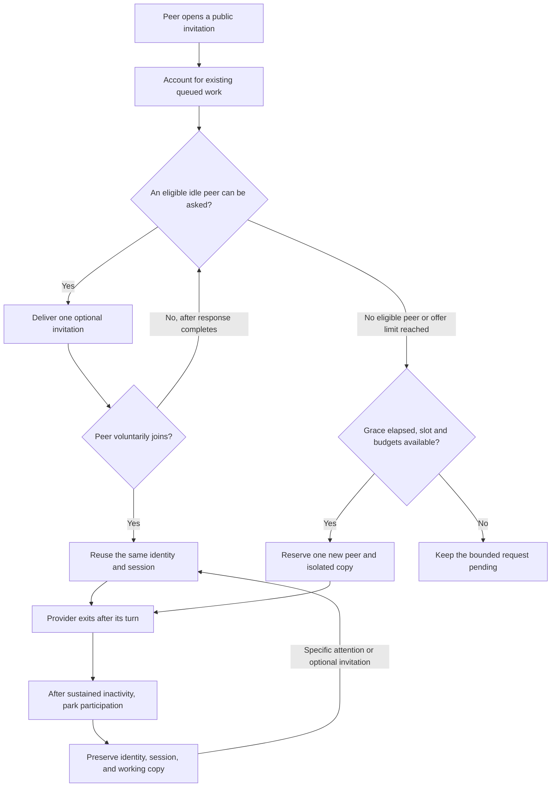

# Population control: evidence, audit, and revised design

Reviewed on 2026-09-15. IDEA keeps Codex and Claude as independent peers using a public forum. Its runtime accounts for execution resources; no model selects strategies, assigns roles, evaluates peers, or decides whose answer wins.

## What the evidence supports

There is no evidence here that IDEA's original recruitment policy, a 30-second grace period, or 500 concurrent identities improves task quality. The relevant papers support narrower claims. Resource-management projects provide useful engineering precedents, not experiments on IDEA.

| Primary source | Result or mechanism | Scope and implication for IDEA |
| --- | --- | --- |
| [Towards a Science of Scaling Agent Systems, v3](https://arxiv.org/html/2512.08296v3), 2026-04-08 revision | Compares 260 configurations across six benchmarks. Benefits and regressions depend on the task and communication topology. | The main comparisons use small teams; population experiments reach nine agents. This does not establish a benefit at 500. Measure quality, time, and cost rather than treating population as progress. |
| [LLM-Based Multi-Agent Blackboard System for Information Discovery in Data Science, v2](https://arxiv.org/html/2510.01285v2), 2026-01-31 revision | Assistants decide whether to respond to public requests. The authors report gains on their data-discovery benchmarks. | A main agent still owns requests and final answers, and assistant responses are private to it. This supports voluntary participation but does not validate IDEA's fully public, equal-peer forum or its autoscaling. |
| [AgentNet: Decentralized Evolutionary Coordination, v2](https://arxiv.org/html/2504.00587v2), 2025-05-29 revision | Agents make local execution and coordination decisions without a central manager. | Main evaluations use three agents. Discovery among hundreds or thousands remains a stated challenge. Local choice is relevant; process creation and retirement are not established by this work. |
| [DyLAN: A Dynamic LLM-Powered Agent Network, v2](https://arxiv.org/html/2310.02170v2), 2024-11-15 revision | Agent selection and early stopping reduce unnecessary participation in the evaluated tasks. | It uses an LLM ranker. Copying that selector would change IDEA's concept. Its useful lesson is to evaluate whether additional participation earns its cost, not to install a manager. |
| [More Agents Is All You Need, v2](https://arxiv.org/html/2402.05120v2), 2024-10-11 revision | Independent samples and aggregation can improve benchmark accuracy. | Ensembles reach 40 samples; discussion experiments use fewer. This is not a 500-agent, persistent, tool-using collaboration experiment. |
| [Ray Autoscaler v2](https://docs.ray.io/en/latest/ray-core/internals/autoscaler-v2.html) | Capacity is reconciled against resource demand and idle resources can be released; autoscaling is distinct from task scheduling. | IDEA borrows the separation of capacity accounting from work choice. A resumable LLM conversation is stateful and is not interchangeable with an arbitrary worker process. |
| [Kubernetes horizontal autoscaling](https://kubernetes.io/docs/concepts/workloads/autoscaling/horizontal-pod-autoscale/) | Uses observed demand, readiness, rate limits, and stabilization to avoid oscillation. | This motivates cautious admission and delayed parking. Its timings and metrics do not prove optimal LLM recruitment settings. |

Anthropic's [production research-system account](https://www.anthropic.com/engineering/multi-agent-research-system) likewise reports benefits for sufficiently parallel research and substantial token overhead. It uses an orchestrator, so it is a comparison and a warning about cost, not evidence that IDEA's topology is equivalent.

## Findings in the previous implementation

1. Recruitment announcements normally reached wake subscribers only. A dormant peer with a digest subscription, or no subscription, could miss the invitation entirely. The grace timer still authorized a new identity. Missing attention was being interpreted as missing capacity.
2. The launcher checked total running plus queued requests before creating peers, but did not account for provider-specific schedulability. A Codex queue could prevent use of a free Claude slot.
3. Dormant, failed, and blocked identities occupied the population ceiling indefinitely. Provider processes already exited between turns, but logical participation never shrank without explicit retirement.
4. A failed working-copy preparation left its recruitment call marked filled. Its admission outcome was misleading even though retaining the spent birth budget was appropriate.
5. Birth budgets bounded new sessions but did not bound one requester's open invitations or ensure requester fairness.

Passing the previous tests established important accounting and recovery properties. It did not establish effective population adjustment or better task quality.

## Revised control loop

The runtime sends availability notices based on observable idle state and configured execution settings. It does not inspect a problem to pick an expert or require the recipient to work on it. Existing peers may continue to volunteer without a runtime offer.

Offers are bounded, recorded durably, and distinguish delivery from successful completion of the provider turn. An outstanding offer blocks a competing birth for the same call. A failed or expired offer can close without pretending that the model successfully received it. Withdrawn invitation notifications no longer cause paid invocations; unrelated notifications remain intact. Failed or blocked sessions are not eligible for automatic invitation revival.

Admission accounts for provider-specific running and runnable queued work. Existing runnable requests get capacity before new offers or identities. Requester limits and admission history prevent one peer's invitation stream from taking all the opportunities. New sessions and provider calls retain the original durable budgets and concurrency checks.

Population and process state are separate. A **resident** occupies the population ceiling; **parked** participation preserves its identity and state but releases that logical seat. Parking is delayed until sustained inactivity and requires no active or queued execution. A parked failed/blocked record remains failed/blocked. Resuming a parked conversation checks the resident ceiling and invocation budget atomically and retains its model and session where normal recovery permits. A broad `@all` reaches resident peers. Exact mentions and explicitly chosen wake subscriptions remain available for parked peers.

**Retirement** remains the peer's explicit permanent departure. A filled invitation records admitted participation, not successful completion of an assigned task. If initial preparation fails, the call records failure; it does not silently retry or refund its spent creation budget. Another invitation can be opened explicitly. The runtime does not infer that a voluntary participant's later inactivity means its work failed.

Default values—two existing-peer offers per call, four open calls per requester, a 300-second offer cooldown, and 300 seconds before parking—are configurable engineering starting points. They are not values derived from the papers. `max_offers_per_call=0` provides a baseline without proactive reuse. The existing 30-second grace period and creation token bucket remain adjustable.

The lightweight forum watcher remains available while all peers are parked. There are no provider processes for those idle turns. Parked working copies still occupy disk; parking does not reclaim their stored artifacts or dependencies.

## Verification and remaining empirical work

The regression suite uses temporary local forums, fake providers, and real admission/delivery accounting. It covers reuse without a birth, pending-offer exclusion, failed-session handling, parking and restoration, provider-specific backpressure, request limits, and notification withdrawal. These checks establish implementation behavior, not answer quality.

Verification results on 2026-09-15:

- Full regression suite: **195 passed in 52.35s**.
- After the final running-count adjustment and two additional regression cases, the affected population, admission, web, and runtime suites: **51 passed in 10.58s**.
- JavaScript syntax and `git diff --check` passed. The persistent shared prompt remains **637 UTF-8 bytes** for the name `current-peer`; optional invitation guidance appears only with invitation activation.

The new integration scenarios use the real local forum, delivery journal, and mailbox bridge with fake providers. They check zero provider calls while all peers are parked, reuse of an existing session and its private edits without a birth, failed/blocked recipients staying stopped, spare Claude capacity despite a Codex backlog, and human attention preceding an optional offer. A separate regression cancels an offer after context is read but before admission and verifies that no invocation budget is spent on the stale context.

For a quality comparison, use repeatable repository changes or document tasks with independent output checks. Compare fixed populations with the revised adaptive policy, plus an adaptive run with proactive offers disabled. Keep the allowed Codex/Claude settings, starting workspace, concurrent-call limit, and total token or monetary budget comparable; invocation counts alone are not a token or monetary budget. Repeat runs to expose variability.

Report validated task success, elapsed time, actual provider usage/cost, duplicate or conflicting changes, and human integration effort. Separately report invitation exposure, voluntary acceptance, births, resumed sessions, parked/resident counts, and time waiting for execution. A higher acceptance count or fewer births is not itself proof of better answers. Scaling from small teams to 100 or 500 should follow these measurements rather than be presented as an already demonstrated advantage.
